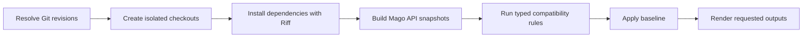

# Architecture

Legato is organized as a deterministic pipeline. The CLI and library API share
the same orchestration path; only progress reporting and final formatting are
CLI concerns.

## Pipeline

1. `repository` validates the repository and resolves `--from` and `--to` to
   commits. If `--from` has no value, it selects the highest stable semantic
   version tag, accepting the `v` and `release-` prefixes.
2. Both revisions are cloned into temporary directories. Hooks are disabled,
   and the caller's working tree is never modified.
3. `composer` reads each root `composer.json` and asks the embedded Riff API to
   install its locked dependencies. A lockless project gets a temporary update
   inside its checkout. Plugins, scripts, audits, and autoloader generation are
   disabled.
4. `snapshot` parses root-package and dependency sources with Mago. Root
   `autoload` paths define the API; dependencies and embedded PHP 8.5 stubs only
   provide inheritance and type context.
5. `compare` runs detectors in compatibility-sensitive order. Each detector
   emits a typed `Rule`, a description, and an optional location.
6. `config` removes findings matched by the configured baseline.
7. `output` renders each requested format. Temporary checkouts and their
   dependency directories are deleted when the comparison is dropped.

Checkout creation is parallelized. Dependency preparation for both revisions
shares one Riff session and is submitted as a batch from a dedicated Tokio
runtime. Snapshot construction and comparison happen only after both installs
have completed successfully.

## Core invariants

### Isolated inputs

Legato never installs into or parses the caller's working tree. All mutable
work happens in temporary clones, including lockfile generation for a project
without `composer.lock`.

### Deterministic platform

The dependency resolver uses one exact PHP version: PHP 8.5.9 by default, or
the override from `legato.toml`. Extension and native-library requirements are
assumed to be present; Legato does not probe or execute PHP. Parsing and
embedded built-in symbols currently use PHP 8.5 independently of that resolver
version.

### Owned API boundary

Only named declarations discovered through the old root package's Composer
`autoload` paths define compatibility obligations. Dependency declarations and
PHP built-ins may affect inheritance and variance checks, but are never emitted
as independent root-package removals.

### Typed findings

The
[`legato-rules`](https://github.com/shyim/legato/tree/main/crates/legato-rules)
crate is the source of truth for a rule's stable identifier, category,
modification type, and compatibility impact. A `Change` stores the rule instead
of copying those fields, preventing contradictory states such as a removal rule
labeled as added.

`Rule::ALL` also anchors completeness tests. The metadata table,
[`RULES.md`](../RULES.md), Serde identifiers, and a real old/new PHP comparison
fixture must all cover the same registry.

### Clean output streams

Human progress and console reports use stderr. Markdown, GitHub Actions, JSON,
and JUnit use stdout. Machine-only invocations suppress progress so stdout
remains directly consumable. See [Output formats](OUTPUT.md).

## Module map

| Area | Location | Responsibility |
| --- | --- | --- |
| Public API | `src/lib.rs` | `check_repository`, options, reports, and public finding types |
| CLI | `src/cli.rs` | Argument parsing, completions, colors, streams, and exit codes |
| Git lifecycle | `src/repository.rs` | Revision resolution, temporary checkouts, orchestration, and cleanup |
| Dependency context | `src/composer.rs` | Composer metadata, embedded Riff requests, vendor paths, and dependency sources |
| API model | `src/snapshot.rs` | Mago parsing, built-in context, inheritance, traits, and source ownership |
| Value model | `src/value.rs` | Safe declaration-value evaluation and opaque fingerprints |
| Detectors | `src/compare.rs` | Ordered old/new API comparison |
| Rule registry | `crates/legato-rules` | Stable identifiers and classification metadata |
| Configuration | `src/config.rs` | Platform, project exclusions, and baselines |
| Formatters | `src/output.rs` | Console, Markdown, GitHub Actions, JSON, and JUnit rendering |
| Embedded stubs | `build.rs` | Build-time encoding of Mago's PHP prelude |

## Compatibility boundary

Legato intentionally follows a specific upstream checker revision while
documenting deviations. Detector behavior and unsupported source changes are
described in [`RULES.md`](../RULES.md); upstream parity decisions are recorded
in [`PARITY.md`](../PARITY.md).

When changing the pipeline or a rule, follow the validation contract in
[`CONTRIBUTING.md`](../CONTRIBUTING.md).
